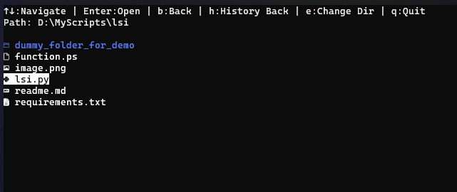

# LSI - List with Icons

A modern file listing tool that displays directory contents with NerdFont icons in the terminal.

## Prerequisites

- Python 3.6+
- NerdFont installed (recommended fonts: Hack Nerd Font, FiraCode Nerd Font)
- Windows PowerShell or PowerShell Core

## Installation

1. Clone the repository:

    ```bash
    git clone https://github.com/adithyarao3103/LSI.git
    ```

2. Navigate to the project directory:

    ```bash
    cd LSI
    ```

3. Install the required dependencies:

    ```bash
    pip install -r requirements.txt
    ```

4. Edit the `function.ps1` file and replace `/path/to/lsi.py` with the actual full path to your `lsi.py` file.

5. Add the content of function.ps1 to your PowerShell profile:

    ```bash
    notepad $PROFILE
    ```
    and paste the content of `function.ps1`.

6. Save the profile and restart your PowerShell session.

## Configuration

If NerdFont is not installed:

1. Open lsi.py
2. Uncomment line 143 or 144 (choose one)
3. Comment out lines 147 and 148

## Usage

After installation simply use `lsi` command in PowerShell.

## Features

1. Navigation using arrow keys. 
2. cd to directory using 'e' key.

